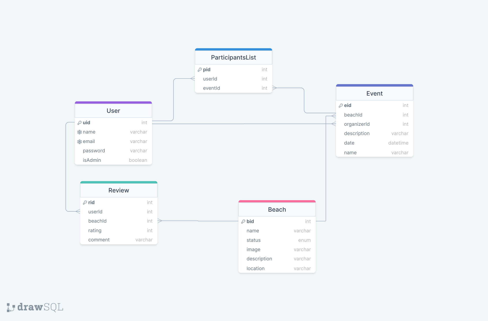

<h1 align="center">Clean Beach</h1>

<div align="center">
    
</div>


## About this project

<br/>

This project is about recycling and maintaining beaches clean, and is all about beaches and volunteering.

It's an app in which shows information about the different beaches of Gran Canaria, and let's users review them in order for people to know how good they are and if they should visit it. It also includes a part which lets users volunteer, so organizers (users) make events in which they set the date, and other users participate in them.

It also works as a tourism promoter, as it shows the beauty and information about the beaches, and locations of the beaches so you can visit them.

## Data Model

<br/>

The data model used for this project looks like this:



## Backend Documentation.

<br/>

For the documentation purpose we used Postman, here you can see the link for the documentation of the endpoints:

Postman Link: https://documenter.getpostman.com/view/23431388/2s93Jrx5XM

## Design

<br/>

For the design of this app we have followed the prototype we did with Figma:

 Link to the Figma: https://www.figma.com/file/cN45eeIzNEGDRYakqpALrc/Beaches?t=d56gSg6kZWZqRFOv-0

 ## Installation guide

 <br/>

- Visual Studio Code.
- MySQL Workbench.
- PostMan, for RESTFul tests.
- npm.

<br/>

### Frontend.

<br/>

* clone this project:
    ```sh
    git clone https://github.com/SergioManuelJob/CleanBeach-Project.git
    ```

* then go to the frontend folder by using::
    ```sh
    cd frontend/
    ```

* and install all of the project dependencies using npm::
    ```sh
    npm install
    ```

### Backend.

<br/>

#### Configure your .env:
*
    ```sh
    DATABASE_URL="UrlToYourDB"
    JWT_SECRET="YourSecret"
    ```

<br/>

* go to the backend:
    ```sh
    cd ../backend/
    ```

* run npm install:
    ```sh
    npm install
    ```

* And in case of any problem with prisma run:
    ```sh
    npm run postinstall
    ```

* Let prisma create the database:
    ```sh
    npm run dbpush
    ```

## Running guide

<br/>

* go to the backend:
    ```sh
    cd backend/
    ```

* run it:
    ```sh
    npm start
    ```

* go to the frontend:
    ```sh
    cd ../frontend
    ```

* run it:
    ```sh
    npm start
    ```

## Technology stack

<br/>

- NodeJS with Prisma.
- React.

## Planification

### Issues:

To see the division of tasks during this project, you can check our distribution of issues via the project page in GitHub: https://github.com/users/SergioManuelJob/projects/2

The division of parts of the project looks like this:

Design: All of the group.
Backend: Gabriel and Sergio.
Frontend: Lydia and Emma for the design and architecture/body of the web page, Sergio took care of integrating the services to connect with the backend and the functionality of the frontend.

### First week:

On the first week we followed a design sprint plan gave to us by Lydia, the icelandic integrant of the group. We gave birth to the idea, and worked on it from the view of the client, thinking what to do in order to achieve the idea we first thought about, and how we wanted to reach our goals. Also, as we finished the design sprint plan earlier than expected, we started building the backend and also started the prototype. During this week, the design sprint plan was leaded mostly by Lydia, as the other components of the group hadn't worked with this type of plan.

This is the link to the design sprint plan: https://www.figma.com/file/47tfAWHGXe225Xl4PFxPr0/UX-design-plan---Module-6?node-id=0%3A1&t=kZ0cAQPlNBf9g35n-1

### Second week:

The backend programmers continued doing the backend, while the frontend programmers finished the prototype and started programming the pages, but not making them functional just the aesthetic of the pages. The documentation for the backend was done, also most of this readme, and the backend was almost finished, meanwhile in the frontend some pages were done. We divided ourselves in two groups, Gabriel and Sergio for the backend, and Emma and Lydia for the frontend.

### Third week:

For the third week, the backend came to a conclusion, it was fully done and heavily validated, and all of the endpoints worked as intended. The frontend was finished and all that was left was to connect it to the backend and make it functional, because the services were left. Meanwhile in this time we started the presentation, so we could present it for class on the very same week on friday. In this week as the backend programmers had already finished their part, started helping in the frontend, so we all worked in the frontend in our separate tasks and backend programmers mostly did functionality things like logging in and such.

### Branches and pushes:

All of the branches and pushes can be seen on this very same repository, the master branch holds the final version, the develop branch was to do most of the pushes when in develop phase, and the other branches was just so frontend could be easier to program, as we did merge most of them with develop later on.

## Authors:

- Sergio Suárez: https://github.com/SergioManuelJob
- Emma Nielsen: https://github.com/Emsenparry
- Gabriel Rodríguez: https://github.com/GabRodPul
- Lydia Stefánsdóttir: https://github.com/lydiastef
